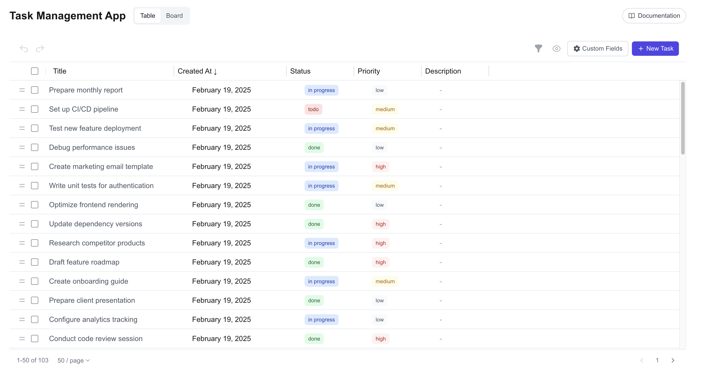
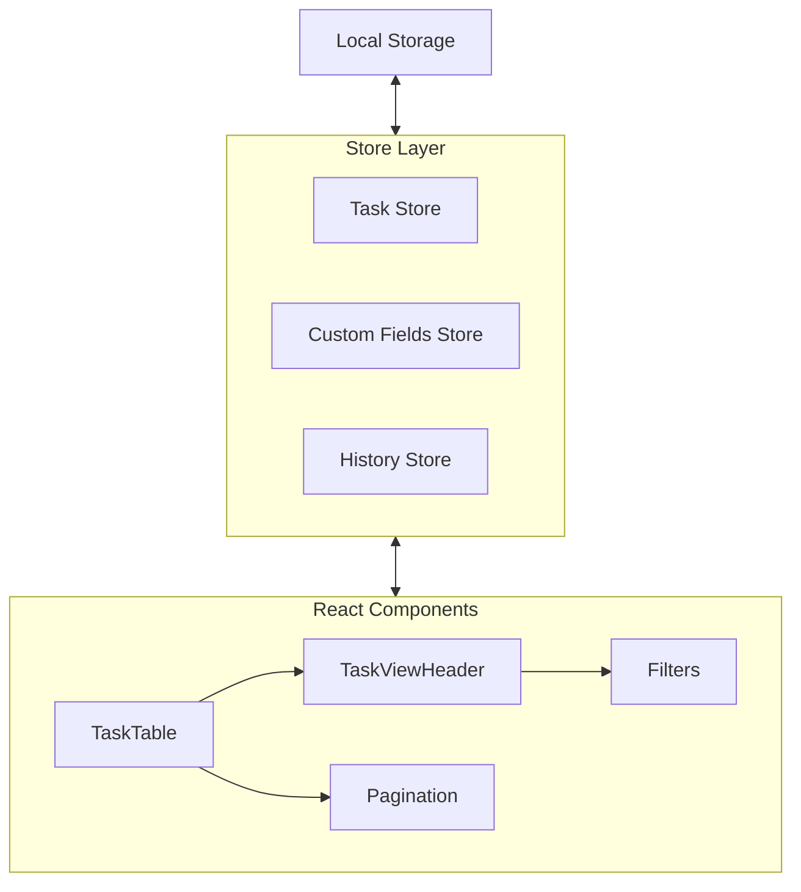

# ✨ Modern Task Management App

A powerful and intuitive task management application built with Next.js 14, featuring both table and board views, custom fields, and real-time filtering.




## 🌟 Features

### Core Functionality
- **📋 Dual View System**
  - Table view with resizable columns
  - Kanban board view with drag-and-drop
  - Persistent view preference

- **💼 Task Management**
  - Create, edit, and delete tasks
  - Batch selection and deletion
  - Sort by any column
  - Advanced filtering system
  - Drag-and-drop reordering

- **🔧 Custom Fields**
  - Add custom fields of different types
  - Show/hide columns
  - Filter by custom field values

- **↩️ History Management**
  - Undo/Redo support
  - Action tracking
  - State persistence

## 🛠️ Tech Stack

- **Framework**: [Next.js 14](https://nextjs.org/) (App Router)
- **Language**: [TypeScript](https://www.typescriptlang.org/)
- **Styling**: [Tailwind CSS](https://tailwindcss.com/)
- **State Management**: [Zustand](https://github.com/pmndrs/zustand)
- **UI Components**: 
  - [Headless UI](https://headlessui.dev/)
  - [Framer Motion](https://www.framer.com/motion/)
  - [Hero Icons](https://heroicons.com/)
- **Drag & Drop**: [@hello-pangea/dnd](https://github.com/hello-pangea/dnd)

## 🏗️ Architecture



## 🚀 Getting Started

1. **Clone the repository**
```bash
git clone https://github.com/yourusername/task-management-app.git
cd task-management-app
```

2. **Install dependencies**
```bash
npm install
# or
yarn install
```

3. **Run the development server**
```bash
npm run dev
# or
yarn dev
```

4. Open [http://localhost:3000](http://localhost:3000) in your browser

## 📁 Project Structure

```
├── app/                 # Next.js app router pages
├── components/         # React components
│   ├── Board/         # Board view components
│   └── Table/         # Table view components
├── store/             # Zustand store definitions
├── hooks/             # Custom React hooks
├── types/             # TypeScript types
└── public/            # Static assets
```

## 🔑 Key Components

- `TaskTable`: Main table view with resizable columns
- `BoardView`: Kanban board with drag-and-drop
- `TaskViewHeader`: Filtering and action controls
- `CustomFieldsEditor`: Custom field management
- `ResizableColumn`: Column width management

## 💾 State Management

The application uses Zustand for state management with three main stores:

```typescript
// Task Store
interface TaskStore {
  tasks: Task[]
  addTask: (task: Task) => void
  updateTask: (id: string, updates: Partial<Task>) => void
  deleteTask: (id: string) => void
}

// Custom Fields Store
interface CustomFieldsStore {
  fields: CustomField[]
  addField: (field: CustomField) => void
  removeField: (id: string) => void
}

// History Store
interface HistoryStore {
  past: State[]
  future: State[]
  undo: () => void
  redo: () => void
}
```

## 📝 License

This project is licensed under the MIT License - see the [LICENSE](LICENSE) file for details.

## 🤝 Contributing

Contributions are welcome! Please feel free to submit a Pull Request.

1. Fork the project
2. Create your feature branch (`git checkout -b feature/AmazingFeature`)
3. Commit your changes (`git commit -m 'Add some AmazingFeature'`)
4. Push to the branch (`git push origin feature/AmazingFeature`)
5. Open a Pull Request

## 📫 Contact

Siddhu - [@siddhucse](https://twitter.com/siddhucse)

Project Link: [https://github.com/vydyas/task-management-app](https://github.com/yourusername/task-management-app)
